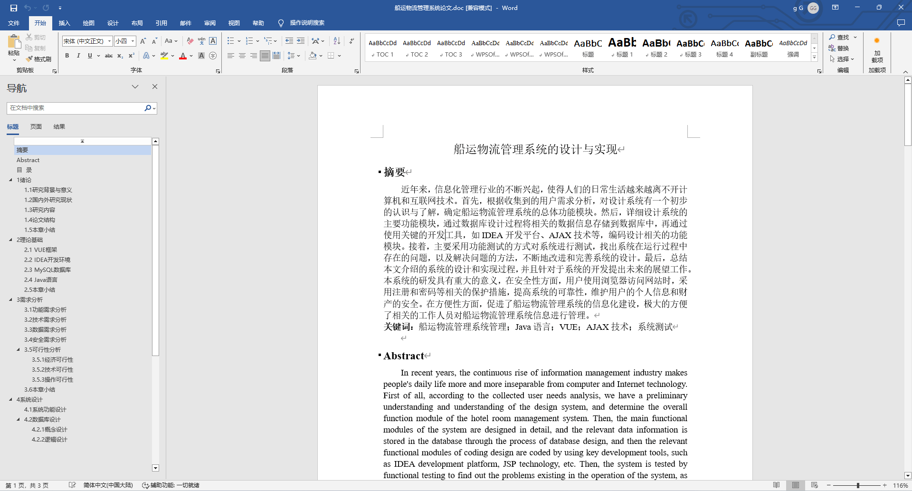
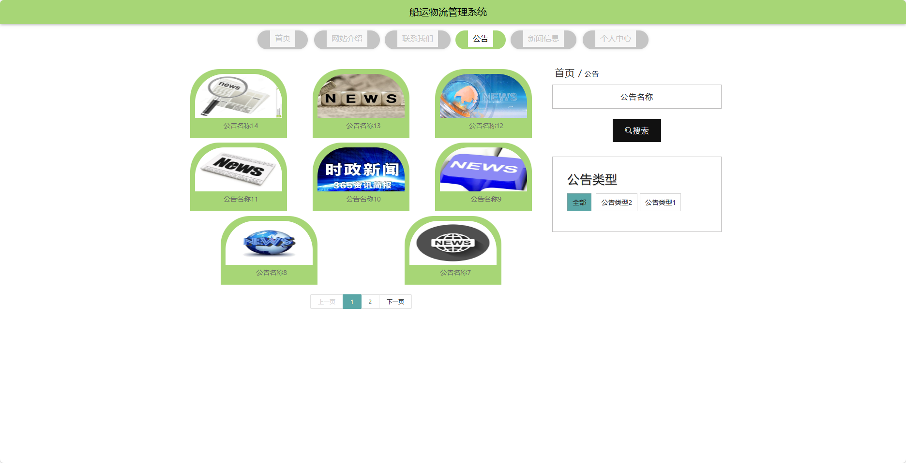
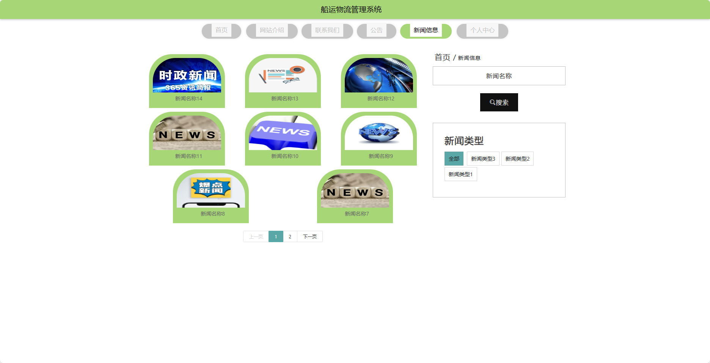
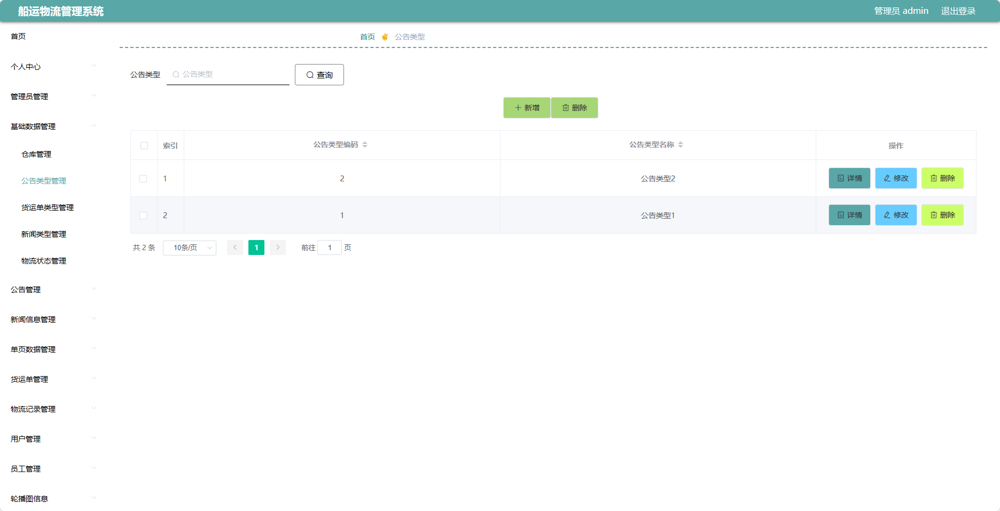
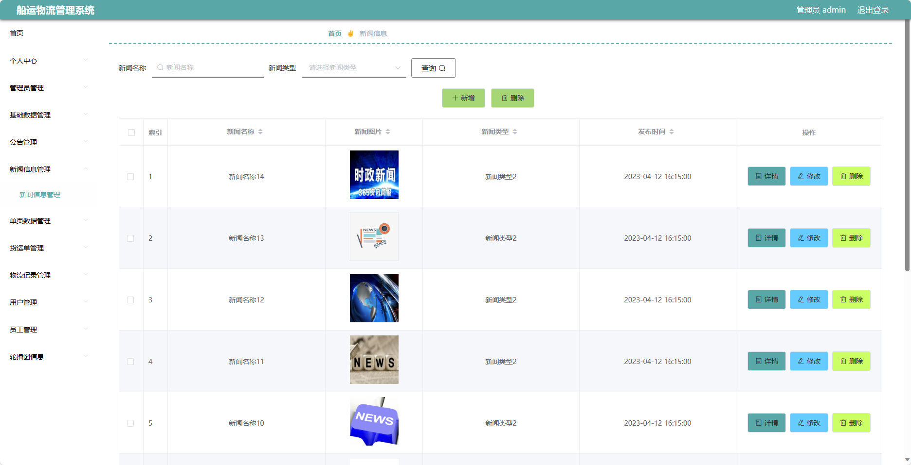
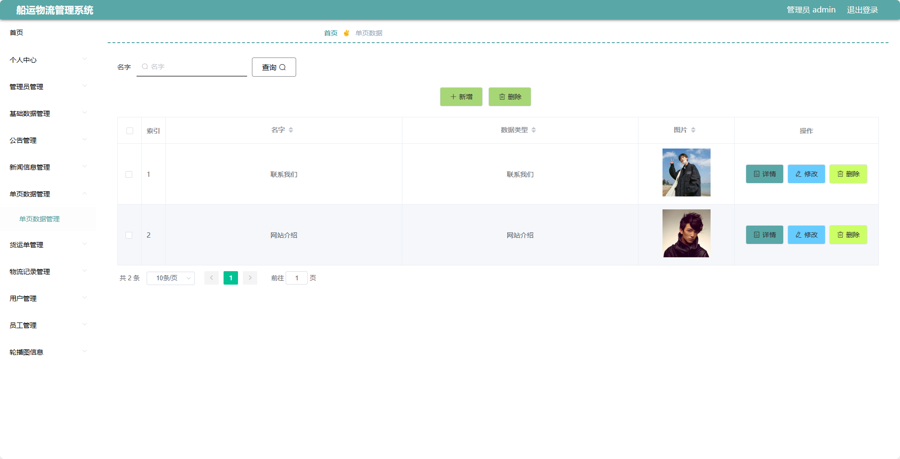

## 基于SpringBoot的船运物流管理系统(程序+报告)

###  获取sql数据库文件: 从戎源码网 (https://armycodes.com/) QQ: 386869957 QQ群: 377586148
###  所有系统地址: (https://github.com/YuLin-Coder/AllProjectCatalog) 
###  所有项目以及源代码本人均调试运行无问题 可支持远程安装部署调试、定制修改、代码讲解

## 项目介绍
基于SpringBoot的船运物流管理系统，系统包含两种角色：管理员、用户,系统分为前台和后台两大模块，主要功能如下。

### 【管理员】:
- 个人中心：管理个人信息和账户。
- 管理员管理：管理系统管理员的信息。
- 基础数据管理：管理系统的基础数据。
- 公告管理：发布和管理系统的公告信息。
- 新闻信息管理：发布和管理行业新闻和相关资讯。
- 单页数据管理：管理网站的单页内容。
- 货运单管理：管理货物的运输订单。
- 物流记录管理：记录和管理物流过程中的相关信息。
- 用户管理：管理系统中的用户信息。
- 员工管理：管理系统中的员工信息。
- 轮播图信息：管理网站首页的轮播图信息。

### 【员工】:
- 个人中心：管理个人信息和账户。
- 公告管理：发布和管理系统的公告信息。
- 新闻信息管理：发布和管理行业新闻和相关资讯。
- 货运单管理：管理货物的运输订单。
- 物流记录管理：记录和管理物流过程中的相关信息。

### 【前台】:
- 首页：展示系统的整体概况和重要信息。
- 网站介绍：介绍系统的功能和特点。
- 公告：查看系统发布的公告信息。
- 联系我们：提供联系方式。
- 新闻信息：浏览最新的行业新闻和相关资讯。
- 个人中心：管理个人信息和账户。

## 项目技术
- 编程语言：Java
- 数据库：MySQL
- 项目管理工具：Maven
- 前端技术：HTML、CSS、JavaScript、Jquery、Vue
- 后端技术：Spring、SpringMVC、MyBatis

## 运行环境
- JDK版本：JDK1.8及以上
- 开发工具：IDEA、Ecplise、Myecplise都可以
- 数据库: MySQL5.7及以上
- Maven：maven3.0及以上
- Node：14.14.0及以上

## 运行截图

